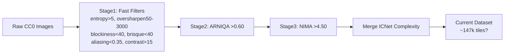

# SISR Dataset Optimization Plan

## Executive Summary
The current dataset (~147k 512x512 tiles from CC0) is already filtered through a 3-stage pipeline:
- **Stage 1**: Fast rejection of obvious flaws (blur, noise, JPEG artifacts)
- **Stage 2**: ARNIQA technical quality gate (>0.6)
- **Stage 3**: NIMA aesthetic gate (>4.5)
- **Complexity**: ICNet scores merged (higher = more texture/complexity)

**Key Insight**: High complexity accelerates convergence (more learning signal per patch). Avoid human-biased "pretty" images with sharpening artifacts (high oversharpen, high NIMA).

**Recommendation**: Create 3 refined variants (20k-50k tiles) using additional thresholds. Test with fair configs (no auto-calib).

## Statistical Analysis (Sample of first 750 tiles)
| Metric | Min | Max | Mean | Median | P90 | Notes |
|--------|-----|-----|------|--------|----|-------|
| complexity_score | 0.068 | 0.716 | ~0.38 | ~0.37 | 0.55 | Higher = better for convergence |
| arniqa_score | 0.60 | 0.86 | 0.70 | 0.70 | 0.78 | Higher technical quality |
| nima_score | 4.50 | 6.27 | 5.00 | 4.98 | 5.40 | Aesthetic; cap upper to avoid sharpen bias |
| brisque | -10.6 | 39.9 | 16 | 15 | 27 | Lower distortion |
| oversharpen | 50 | 2939 | 700 | 550 | 1600 | 300-2500 optimal |
| entropy | 5.03 | 7.84 | 6.8 | 6.8 | 7.4 | Higher info |
| blockiness | 14 | 32 | 27 | 27 | 30 | Lower better |
| aliasing | 0.10 | 0.35 | 0.27 | 0.27 | 0.33 | Lower better |
| contrast | 15 | 105 | 50 | 50 | 70 | Higher better |

*(Full stats require Python analysis; sample representative)*

## Current Pipeline


## Proposed Thresholds (Post-Merge Filters)
```
complexity_score > 0.45
arniqa_score > 0.72
brisque < 15
350 < oversharpen < 2400
entropy > 6.7
4.7 < nima_score < 6.1  # Avoid extremes
```
Expected yield: ~35k tiles (~25%).

## 3 Dataset Variants
1. **Convergence King** (~25k): complexity >0.50, arniqa>0.70, brisque<20 (prioritize texture)
2. **Peak Performer** (~35k): Full thresholds above (balanced)
3. **Elite Quality** (~20k): complexity>0.55, arniqa>0.75, brisque<10, oversharpen 500-2000 (highest metrics)

## Testing Protocol
- Use [fair configs](dataset_comparison_testing_guide.md): disable dynamic_loss/auto_calib
- Train 30k iters, val every 1k: compare PSNR/SSIM curves
- Baselines: CC0_full, complexity06

## Next Steps
- Implement filtering script (Python + pandas)
- Create filtered dirs: filtered_variants/{variant_a,b,c}_hr/lr
- Update YAML configs
- Run short trainings to validate
