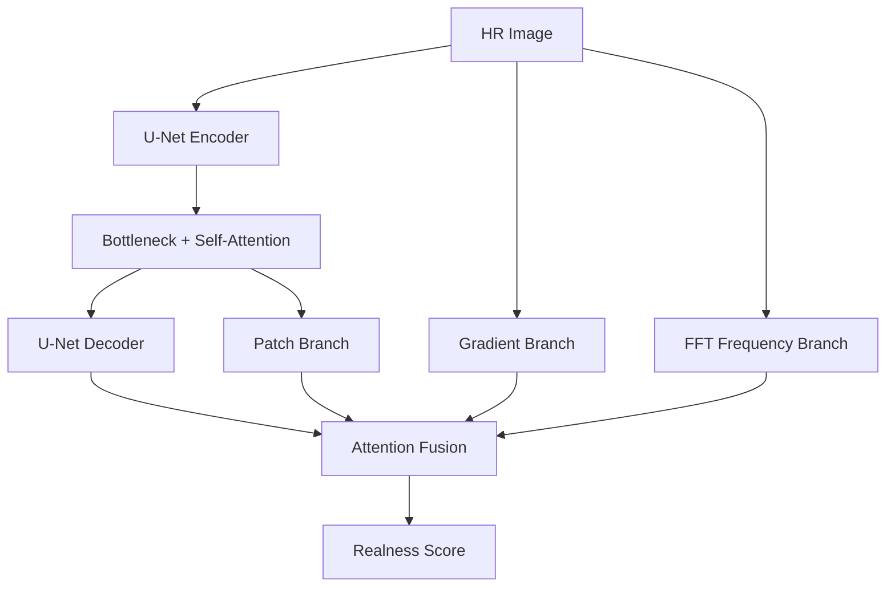

# MUNet: Multi-Branch U-Net Discriminator

**MUNet** is a specialized discriminator for Super-Resolution GANs that analyzes images across **four distinct domains** simultaneously, acting as a "Multi-View Critic."

**Author:** Philip Hofmann
**License:** MIT

---

## 🎯 Design Philosophy

Traditional discriminators (like VGG-style PatchGAN) only analyze spatial features. MUNet extends this by detecting artifacts that manifest differently across domains:

| Artifact Type | Detection Domain | Branch |
|--------------|------------------|--------|
| Structural distortion | Spatial coherence | **Spatial (U-Net)** |
| Edge ringing, jaggies | Gradient magnitude | **Gradient** |
| Blur, oversharpening | Frequency spectrum | **Frequency (FFT)** |
| Texture inconsistency | Patch-level features | **Patch** |

---

## 🏗️ Architecture



### Branch Details

1. **Spatial Branch**: Full U-Net encoder-decoder with skip connections for global structure analysis
2. **Gradient Branch**: Computes image gradients (Sobel-like) to detect edge artifacts
3. **Frequency Branch**: FFT magnitude spectrum to detect spectral anomalies
4. **Patch Branch**: Bottleneck features upsampled for local texture consistency

### Attention Fusion
Instead of averaging branch outputs, a learned attention mechanism weights branches **per spatial location**:
- Prioritizes Gradient branch on edges
- Prioritizes Frequency branch in textured regions

---

## ⚡ Quick Start

### Python Usage
```python
from traiNNer.archs.munet_arch import MUNet

# For ParagonSR2 Photo/Pro variants
disc = MUNet(num_in_ch=3, num_feat=64, ch_mult=(1, 2, 4, 8))

# For lighter Realtime/Stream variants
disc = MUNet(num_in_ch=3, num_feat=32, ch_mult=(1, 2, 2))
```

### Training Config (YAML)
```yaml
network_d:
  type: MUNet
  num_in_ch: 3
  num_feat: 64
  ch_mult: [1, 2, 4, 8]
```

---

## 🔗 Usage with FeatureMatchingLoss

MUNet works best when combined with `FeatureMatchingLoss` for stabilized GAN training:

```yaml
losses:
  - type: FeatureMatchingLoss
    loss_weight: 1.0
    criterion: l1
    layers: [1, 2, -1]  # Early, mid, and bottleneck features
```

The loss encourages the generator to produce features that the discriminator finds similar to real images—especially useful with MUNet's multi-branch design.

---

## ⚙️ Configuration

| Parameter | Default | Description |
|-----------|---------|-------------|
| `num_in_ch` | 3 | Input channels (RGB) |
| `num_feat` | 64 | Base feature channels |
| `ch_mult` | (1, 2, 4, 8) | Channel multipliers per encoder stage |
| `slope` | 0.2 | LeakyReLU negative slope |

### Recommended Configurations

| Generator | `num_feat` | `ch_mult` | Approx. Params |
|-----------|------------|-----------|----------------|
| Realtime | 32 | (1, 2, 2) | ~500K |
| Stream | 32 | (1, 2, 4) | ~1M |
| Photo | 64 | (1, 2, 4, 8) | ~8M |
| Pro | 64 | (1, 2, 4, 8) | ~8M |

---

## 🔬 Technical Notes

### Spectral Normalization
All convolutions use spectral normalization for training stability, following best practices from SA-GAN.

### Gradient Computation
Uses replicate padding instead of zero padding to prevent the discriminator from overfitting to border artifacts.

### Frequency Analysis
FFT is computed on grayscale, centered with `fftshift`, and log-scaled magnitude is used as features.

---

## 📜 Citation

```bibtex
@software{munet,
  author = {Philip Hofmann},
  title = {MUNet: Multi-Branch U-Net Discriminator},
  year = {2024},
  url = {https://github.com/Phhofm/traiNNer-redux}
}
```
