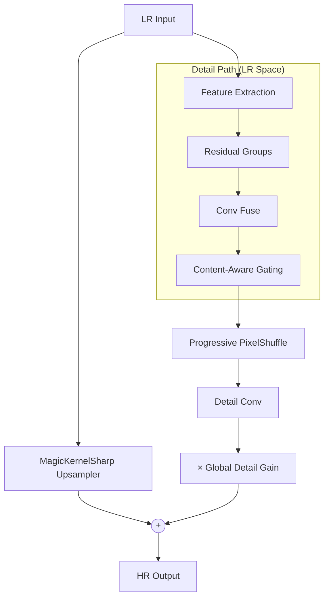

# ParagonSR2: Efficient Dual-Path Super-Resolution

**ParagonSR2** is a "Product-First" Single Image Super-Resolution (SISR) architecture designed to bridge the gap between lightweight CNNs (fast but limited) and modern Transformers (powerful but heavy).

**Author:** Philip Hofmann
**License:** MIT

---

## 🎯 Key Innovations

### 1. Dual-Path Architecture
```
Path A (Base):   LR → MagicKernelSharp → Structural Anchor
Path B (Detail): LR → Deep Body (LR Space) → PixelShuffle → Texture Residual
Output = Base + (Detail × ContentGain × GlobalGain)
```

- **Path A** uses deterministic B-Spline interpolation to anchor structure, preventing geometry warping
- **Path B** processes in efficient LR space before upsampling via PixelShuffle

### 2. Shifted Window Attention (Swin-style)
Photo and Pro variants use alternating shifted/non-shifted windows to create cross-window connections without visible boundary artifacts.

### 3. Content-Aware Detail Gating
Analyzes **deep features** (not LR input) to distinguish texture from noise:
- Smooth areas (sky, walls) → Suppresses detail to prevent noise amplification
- Textured areas (grass, fabric) → Boosts detail for restoration

### 4. Progressive Upsampling
For 4x/8x scales, uses multiple 2x stages with intermediate refinement to reduce checkerboard artifacts.

---

## 🚀 Model Variants

| Variant | Code Name | Channels | Groups × Blocks | Block Type | Attention | Target |
|---------|-----------|----------|-----------------|------------|-----------|--------|
| **Realtime** | `paragonsr2_realtime` | 16 | 1 × 3 | MBConv | No | Video/Anime @ 60fps |
| **Stream** | `paragonsr2_stream` | 32 | 2 × 3 | Gated FFN | No | Compressed video |
| **Photo** | `paragonsr2_photo` | 64 | 4 × 4 | Paragon | Yes | General photography |
| **Pro** | `paragonsr2_pro` | 96 | 6 × 6 | Paragon | Yes | Archival restoration |

> [!IMPORTANT]
> **Pro variant** requires 24GB+ VRAM for training. Recommended for offline rendering only.

---

## ⚡ Quick Start

### Python Usage
```python
from traiNNer.archs.paragonsr2_arch import paragonsr2_photo

# Create 2x upscaling model
model = paragonsr2_photo(scale=2)

# For fidelity training (pure reconstruction)
model = paragonsr2_photo(scale=2, upsampler_alpha=0.0)

# For GAN training (perceptual sharpening)
model = paragonsr2_photo(scale=2, upsampler_alpha=0.4)
```

### ONNX Export
```bash
python scripts/paragonsr2/convert_onnx_release.py \
    --checkpoint "models/paragonsr2_photo_x2.safetensors" \
    --arch paragonsr2_photo \
    --scale 2 \
    --output "release_onnx"
```

### TensorRT Deployment
```bash
trtexec --onnx=release_onnx/paragonsr2_photo_fp32.onnx \
        --saveEngine=paragonsr2_photo_fp16.trt \
        --fp16 \
        --minShapes=input:1x3x64x64 \
        --optShapes=input:1x3x512x512 \
        --maxShapes=input:1x3x720x720
```

---

## ⚙️ Key Parameters

| Parameter | Default | Description |
|-----------|---------|-------------|
| `scale` | 4 | Upscaling factor (2, 3, 4, or 8) |
| `upsampler_alpha` | 0.4 | Base path sharpening. `0.0` = pure reconstruction (PSNR), `0.3-0.6` = perceptual (GAN) |
| `detail_gain` | 0.1 | Initial learnable multiplier for detail path magnitude |
| `use_content_aware` | True | Enable content-aware gating (disable for Realtime) |

---

## 🏗️ Architecture Diagram



---

## 📊 Recommended MUNet Discriminator Pairing

| Generator Variant | MUNet Config |
|------------------|--------------|
| Realtime / Stream | `num_feat=32, ch_mult=(1, 2, 2)` |
| Photo / Pro | `num_feat=64, ch_mult=(1, 2, 4, 8)` |

See [README_MUNet.md](README_MUNet.md) for discriminator details.

---

## � Benchmarks

> **All development, training, testing, and benchmarking was performed on consumer-grade hardware.**

### System Specs

| Component | Specification |
|-----------|--------------|
| **GPU** | NVIDIA GeForce RTX 3060 (12 GB VRAM) |
| **CPU** | AMD Ryzen 5 3600 (6-core / 12-thread) |
| **RAM** | 16 GB DDR4 |
| **OS** | Ubuntu 24.10 (Linux 6.11) |
| **PyTorch** | 2.9.0 + CUDA 12.8 |

### Inference Speed (2x Upscaling)

**Dataset:** Urban100 x2 LR Set

#### paragonsr2_realtime (16K params)
| Backend | Avg Latency | FPS | Peak VRAM |
|---------|-------------|-----|-----------|
| PyTorch FP32 | 86.7 ms | 11.5 | 0.27 GB |
| PyTorch FP16 | 86.4 ms | 11.6 | 0.10 GB |
| TensorRT FP16 | **2.7 ms** | **376.2** | 0.03 GB |

#### paragonsr2_stream (95K params, content_aware=false)
| Backend | Avg Latency | FPS | Peak VRAM |
|---------|-------------|-----|-----------|
| PyTorch FP32 | 183.1 ms | 5.5 | 0.53 GB |
| PyTorch FP16 | 177.2 ms | 5.6 | 0.21 GB |
| TensorRT FP16 | **8.5 ms** | **118.0** | 0.03 GB |

#### paragonsr2_photo (1.9M params)
| Backend | Avg Latency | FPS | Peak VRAM |
|---------|-------------|-----|-----------|
| PyTorch FP32 | 1340.8 ms | 0.7 | 1.34 GB |
| PyTorch FP16 | **436.3 ms** | **2.3** | 0.79 GB |
| TensorRT FP16 | 626.1 ms | 1.6 | 0.03 GB |

> [!NOTE]
> **PyTorch FP16 beats TensorRT for Photo** due to FlashAttention (SDPA) being highly optimized for dynamic shapes. TensorRT excels with fixed-size inputs.

> [!NOTE]
> **Stream fidelity model** was trained with `use_content_aware=false` for maximum training speed. Use `--use_content_aware false` when loading this checkpoint.

### TensorRT Build Limits (RTX 3060 12GB)

| Variant | Max Shapes | Build Command |
|---------|-----------|---------------|
| Realtime | 1080x1080 | `--maxShapes=input:1x3x1080x1080` |
| Stream | 1024x1024 | `--maxShapes=input:1x3x1024x1024` |
| Photo | 720x720 | `--maxShapes=input:1x3x720x720` |

---

## �📜 Citation

If you use ParagonSR2 in your research, please cite:

```bibtex
@software{paragonsr2,
  author = {Philip Hofmann},
  title = {ParagonSR2: Efficient Dual-Path Super-Resolution},
  year = {2024},
  url = {https://github.com/Phhofm/traiNNer-redux}
}
```
