# ParagonSR2: Efficient Dual-Path Super-Resolution

**ParagonSR2** is a "Product-First" Single Image Super-Resolution (SISR) architecture designed to bridge the gap between lightweight CNNs (fast but limited) and modern Transformers (powerful but heavy).

**Author:** Philip Hofmann
**License:** MIT

---

## 🎯 Key Innovations

### 1. Dual-Path Architecture
```
Path A (Base):   LR → MagicKernelSharp → Structural Anchor
Path B (Detail): LR → Deep Body (LR Space) → PixelShuffle → Texture Residual
Output = Base + (Detail × ContentGain × GlobalGain)
```

- **Path A** uses deterministic B-Spline interpolation to anchor structure, preventing geometry warping
- **Path B** processes in efficient LR space before upsampling via PixelShuffle

### 2. Shifted Window Attention (Swin-style)
Photo and Pro variants use alternating shifted/non-shifted windows to create cross-window connections without visible boundary artifacts.

### 3. Content-Aware Detail Gating
Analyzes **deep features** (not LR input) to distinguish texture from noise:
- Smooth areas (sky, walls) → Suppresses detail to prevent noise amplification
- Textured areas (grass, fabric) → Boosts detail for restoration

### 4. Progressive Upsampling
For 4x/8x scales, uses multiple 2x stages with intermediate refinement to reduce checkerboard artifacts.

---

## 🚀 Model Variants

| Variant | Code Name | Channels | Groups × Blocks | Block Type | Attention | Target |
|---------|-----------|----------|-----------------|------------|-----------|--------|
| **Realtime** | `paragonsr2_realtime` | 16 | 1 × 3 | MBConv | No | Video/Anime @ 60fps |
| **Stream** | `paragonsr2_stream` | 32 | 2 × 3 | Gated FFN | No | Compressed video |
| **Photo** | `paragonsr2_photo` | 64 | 4 × 4 | Paragon | Yes | General photography |
| **Pro** | `paragonsr2_pro` | 96 | 6 × 6 | Paragon | Yes | Archival restoration |

> [!IMPORTANT]
> **Pro variant** requires 24GB+ VRAM for training. Recommended for offline rendering only.

---

## ⚡ Quick Start

### Python Usage
```python
from traiNNer.archs.paragonsr2_arch import paragonsr2_photo

# Create 2x upscaling model
model = paragonsr2_photo(scale=2)

# For fidelity training (pure reconstruction)
model = paragonsr2_photo(scale=2, upsampler_alpha=0.0)

# For GAN training (perceptual sharpening)
model = paragonsr2_photo(scale=2, upsampler_alpha=0.4)
```

### ONNX Export
```bash
python scripts/paragonsr2/convert_onnx_release.py \
    --checkpoint "models/paragonsr2_photo_x2.safetensors" \
    --arch paragonsr2_photo \
    --scale 2 \
    --output "release_onnx"
```

### TensorRT Deployment
```bash
trtexec --onnx=release_onnx/paragonsr2_photo_fp32.onnx \
        --saveEngine=paragonsr2_photo_fp16.trt \
        --fp16 \
        --minShapes=input:1x3x64x64 \
        --optShapes=input:1x3x512x512 \
        --maxShapes=input:1x3x720x720
```

---

## ⚙️ Key Parameters

| Parameter | Default | Description |
|-----------|---------|-------------|
| `scale` | 4 | Upscaling factor (2, 3, 4, or 8) |
| `upsampler_alpha` | 0.4 | Base path sharpening. `0.0` = pure reconstruction (PSNR), `0.3-0.6` = perceptual (GAN) |
| `detail_gain` | 0.1 | Initial learnable multiplier for detail path magnitude |
| `use_content_aware` | True | Enable content-aware gating (disable for Realtime) |

---

## 🏗️ Architecture Diagram

```mermaid
graph TD
    LR[LR Input] --> Base[MagicKernelSharp Upsampler]
    LR --> Conv[Feature Extraction]

    subgraph "Detail Path (LR Space)"
        Conv --> Body[Residual Groups]
        Body --> Fuse[Conv Fuse]
        Fuse --> CAG[Content-Aware Gating]
    end

    CAG --> PS[Progressive PixelShuffle]
    PS --> Out[Detail Conv]
    Out --> Gain[× Global Detail Gain]

    Base --> Add((+))
    Gain --> Add
    Add --> HR[HR Output]
```



---

## 📊 Recommended MUNet Discriminator Pairing

| Generator Variant | MUNet Config |
|------------------|--------------|
| Realtime / Stream | `num_feat=32, ch_mult=(1, 2, 2)` |
| Photo / Pro | `num_feat=64, ch_mult=(1, 2, 4, 8)` |

See [README_MUNet.md](README_MUNet.md) for discriminator details.

---

## 📜 Citation

If you use ParagonSR2 in your research, please cite:

```bibtex
@software{paragonsr2,
  author = {Philip Hofmann},
  title = {ParagonSR2: Efficient Dual-Path Super-Resolution},
  year = {2024},
  url = {https://github.com/Phhofm/traiNNer-redux}
}
```
