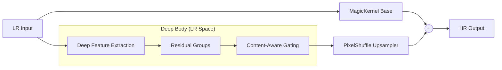

Here is the updated, professional `README.md`. It integrates your specific deployment pipeline (Dynamic ONNX $\to$ TensorRT FP16) as the recommended way to use the model, highlighting that the architecture was specifically engineered for this workflow.

***

# ParagonSR2: Efficient Dual-Path Super-Resolution

**ParagonSR2** is a "Product-First" Single Image Super-Resolution (SISR) architecture designed to bridge the gap between lightweight CNNs (fast but limited) and modern Transformers (powerful but heavy).

It employs a **Hybrid Dual-Path** design that separates structural integrity from texture generation, processing the majority of data in Low-Resolution (LR) space to maximize inference efficiency.

Also included is **MUNet** (Multi-Branch U-Net), a state-of-the-art discriminator designed specifically to train ParagonSR2 for perceptual quality.

---

## 📐 Design Philosophy

Most SR architectures force a compromise: choose *speed* (FSRCNN, ESPCN) or choose *quality* (SwinIR, HAT). ParagonSR2 creates a third option by strictly optimizing for **deployment constraints**:

1.  **Dual-Path Architecture**:
    *   **Path A (Base):** Uses **MagicKernelSharp**, a deterministic B-Spline interpolator, to anchor the image structure. This prevents geometry warping and ensures a graceful failure mode.
    *   **Path B (Detail):** A deep neural network predicts *only* high-frequency residuals (textures, fine edges) in efficient LR space.
2.  **Deployment Focus**:
    *   Engineered for **ONNX/TensorRT** export (static graphs, memory-aligned channels).
    *   Uses **Window Attention** via PyTorch's `scaled_dot_product_attention` (FlashAttention) for maximum training efficiency.
    *   Includes a dedicated export pipeline to generate Dynamic FP32 ONNX models optimized for TensorRT FP16 execution.
3.  **Specialized Variants**:
    *   Instead of simply scaling depth, each variant uses specific blocks (MBConv, Gated FFN, or Transformer) tailored to its specific use case (Video vs. Photo vs. Restoration).

---

## 🚀 Model Variants

ParagonSR2 is released in four distinct tiers, each optimized for a specific hardware class and use case.

| Variant | Name in Code | Channels | Blocks/Group | Block Type | Attention | Target Use Case |
| :--- | :--- | :--- | :--- | :--- | :--- | :--- |
| **Realtime** | `paragonsr2_realtime` | 16 | 3 | MBConv (Nano) | No | **Video / Anime**. Optimized for iGPUs and Mobile. |
| **Stream** | `paragonsr2_stream` | 32 | 3 | Gated FFN | No | **Compressed Video**. Features a wide receptive field to handle compression blocking. |
| **Photo** | `paragonsr2_photo` | 64 | 4 | Paragon | Yes | **General Photography**. The balanced standard for image upscaling. |
| **Pro** | `paragonsr2_pro` | 96 | 6 | Paragon | Yes | **Archival / Restoration**. Maximum fidelity with deep context for complex textures. |

---

## ⚡ Deployment Pipeline (TensorRT)

ParagonSR2 is designed for the **PyTorch $\to$ ONNX $\to$ TensorRT** pipeline. We provide a specialized conversion script that:
1.  Patches PyTorch-specific layers (e.g., `AdaptiveAvgPool`) to TensorRT-optimized equivalents (`ReduceMean`).
2.  Exports a **Dynamic FP32 ONNX** graph.
3.  Validates the export accuracy against the original checkpoint.

### Step 1: Convert Checkpoint to ONNX
Use the included `convert_onnx_release.py` script. This generates a clean, dynamic ONNX file.

```bash
python convert_onnx_release.py \
    --checkpoint "models/paragon_pro_x4.safetensors" \
    --arch paragonsr2_pro \
    --scale 4 \
    --output "release_output" \
    --val_dir "path/to/test_images"  # Optional: Validates accuracy
```

### Step 2: Build TensorRT Engine
We recommend converting the FP32 ONNX to an **FP16 TensorRT Engine** for maximum throughput. The dynamic export allows you to define an optimization profile for your specific resolution needs.

```bash
# Example for 1080p -> 4K upscaling
trtexec --onnx=release_output/paragonsr2_pro_fp32.onnx \
        --saveEngine=paragonsr2_pro_fp16.trt \
        --fp16 \
        --minShapes=input:1x3x64x64 \
        --optShapes=input:1x3x1080x1920 \
        --maxShapes=input:1x3x1080x1920
```
*   `--fp16`: Enables half-precision inference (significantly faster on Tensor Cores).
*   `--optShapes`: The resolution you expect to process most often.

---

## 🏛️ Architecture Details

### Generator: ParagonSR2
The generator processes the input image through two parallel paths:



### Discriminator: MUNet
Training involves **MUNet** (Multi-Branch U-Net), a "Multi-View Critic" that assesses image quality across four distinct domains simultaneously:

*   **Spatial Branch:** U-Net decoder to check global structure.
*   **Gradient Branch:** Detects edge ringing and "jaggies."
*   **Frequency Branch:** FFT-based detection of spectral anomalies (blur/oversharpening).
*   **Patch Branch:** Ensures local texture consistency.

---

## ⚙️ Configuration & Training Tips

### The `upsampler_alpha` Parameter
A unique feature of ParagonSR2 is the configurable `upsampler_alpha` in the base path. This controls the sharpness of the structural anchor.

*   **`alpha=0.0`**: Pure reconstruction. **Recommended for L1/PSNR training** and the "Stream" variant (to avoid sharpening compression artifacts).
*   **`alpha=0.3 - 0.6`**: Perceptual sharpening. **Recommended for GAN training** and "Realtime/Pro" variants to aid in texture generation.

### Content-Aware Gating
The `ContentAwareDetailProcessor` modulates the detail path based on input complexity.
*   **Flat areas:** Detail gain is suppressed to prevent noise amplification.
*   **Texture areas:** Detail gain is boosted to enhance restoration.
*   *Note:* This is disabled in the `Realtime` variant to minimize latency.

---

## 📜 License

This project is licensed under the MIT License.

---

**Author:** Philip Hofmann
